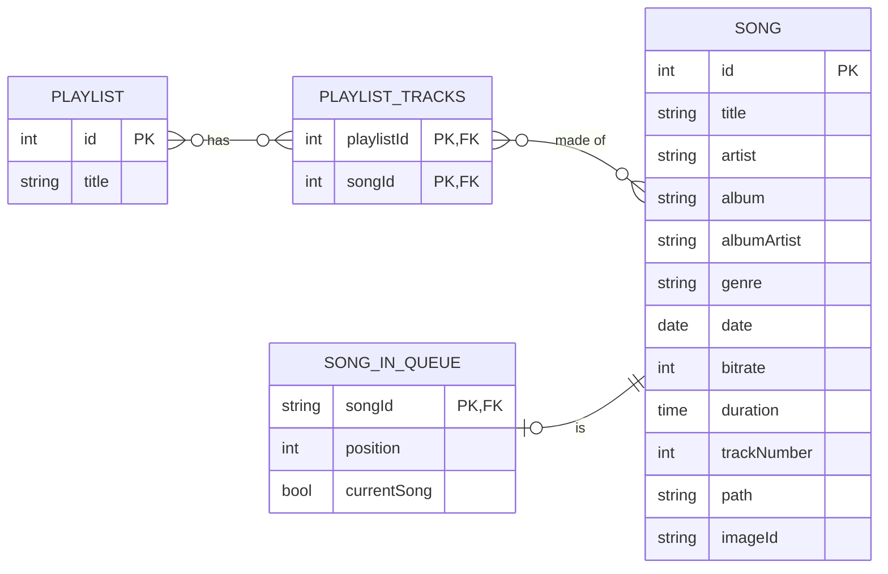

```mermaid
erDiagram
    direction LR
    SONG{
        int id PK
        string title
        string artist
        string album
        string albumArtist
        string genre
        date date
        int bitrate
        time duration
        int trackNumber
        string path
        string imageId
    }
    PLAYLIST{
        int id PK
        string title
    }
    PLAYLIST_TRACKS{
        int playlistId PK, FK
        int songId PK, FK
    }

    SONG_IN_QUEUE{
        string songId PK, FK
        int position
        bool currentSong
    }
    PLAYLIST_TRACKS }o--o{ SONG : "made of"
    PLAYLIST }o--o{ PLAYLIST_TRACKS : "has"
    SONG_IN_QUEUE o|--|| SONG : "is"
```
```
