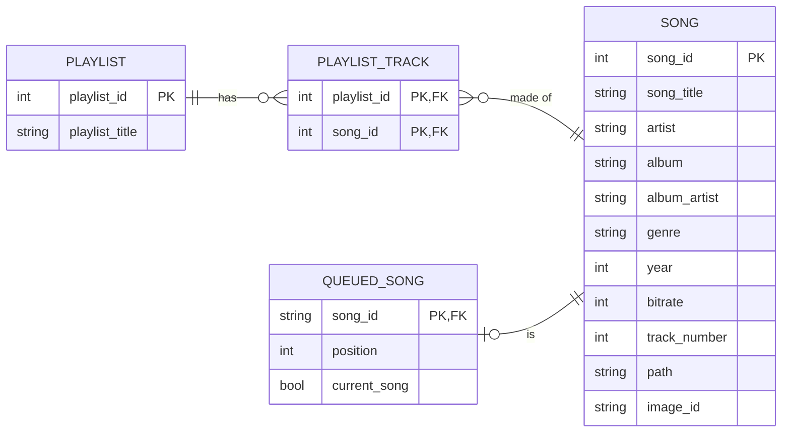

```mermaid
erDiagram
    direction LR
    SONG{
        int song_id PK
        string song_title
        string artist
        string album
        string album_artist
        string genre
        int year
        int bitrate
        int track_number
        string path
        string image_id
    }
    PLAYLIST{
        int playlist_id PK
        string playlist_title
    }
    PLAYLIST_TRACK{
        int playlist_id PK, FK
        int song_id PK, FK
    }

    QUEUED_SONG{
        string song_id PK, FK
        int position
        bool current_song
    }
    PLAYLIST_TRACK }o--|| SONG : "made of"
    PLAYLIST ||--o{ PLAYLIST_TRACK : "has"
    QUEUED_SONG o|--|| SONG : "is"
```
```
